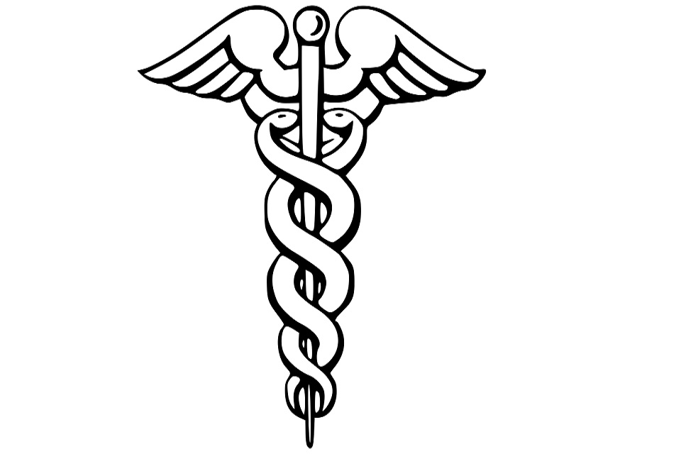

# Caduceo

<!---  
--->
[Caduceo](https://en.wikipedia.org/wiki/Caduceus) 
is a winged staff with two snakes coiled around it was the staff of wisdom, attributed to the god Hermes / Mercury.

This is a framework written for fun and to learn the Rust language probably many features need a refactory and more accurate testing.

